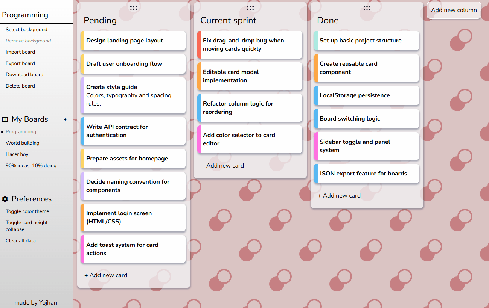

# 🧩 Flexboard

A Trello-inspired kanban board built entirely with vanilla JavaScript — fast, private, and fully customizable.  
[🎮 Live Demo](https://sryojhan.github.io/flexboard/)

---

## 🎯 Goal

This project began as an extension of The Odin Project's task list challenge, evolving into a full-featured Trello-style application. The goal was to tackle UI complexity, DOM architecture, and user experience in a larger-scale frontend project — without relying on libraries or frameworks.

---

## ⚙️ How it Works

- Create an unlimited number of **boards**, each with its own name and background.
- Inside each board, add **columns** freely and fill them with **cards**.
- Cards include a name, description, and a color label for quick visual identification.
- All elements are **fully editable** via a custom **modal system**.
- The UI includes **toast notifications** to handle feedback, errors, and actions.
- Boards are **persisted in local storage** and can be **exported as JSON**.
- Drag and drop is implemented using the native HTML API, with custom enhancements:
  - Cards, columns and boards are **fully reorderable**.
  - A **custom ghost image** replaces the default drag preview for a cleaner, branded interaction.
  - Elements include **visual feedback while dragging** for improved UX.
- Includes a collapsible sidebar panel for quick access to features.
- No backend, no loading times, and all data remains private on your machine.

---

## ✨ Features

- 📁 Multiple boards with custom names and backgrounds
- 🧱 Columns and cards with full editing
- 🖊️ Modal system for detailed card editing
- 🎨 Card labeling by color
- 💬 Toast notifications for alerts and feedback
- 🔄 Drag & drop for cards, columns and boards
- 🌀 Custom ghost image and visual drag feedback
- 💾 Local storage persistence
- 📤 JSON export for board data
- ⚡ Instant interactions, no loading screens
- 🧼 Clean and intuitive UI with responsive layout

---

## 📸 Media

  
  

---

## 🧰 Technologies Used

- JavaScript (ES6)
- HTML/CSS
- Native HTML Drag and Drop API
- LocalStorage API
- Custom UI components (modals, toasts, ghost image system)

---

## 👤 Author

**Yojhan Steven García Peña**  
[🌐 Portfolio](https://sryojhan.github.io/) • [🐙 GitHub](https://github.com/sryojhan) • [🎮 Itch.io](https://yojhan.itch.io/) • [✉️ Email](mailto:imyojhan@gmail.com)
